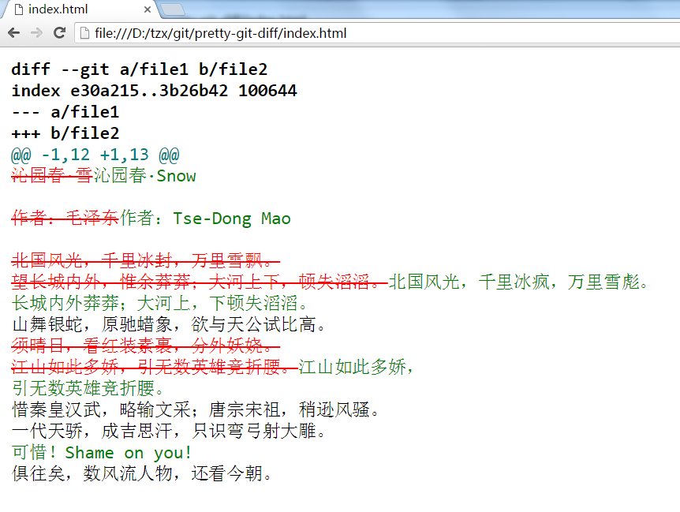
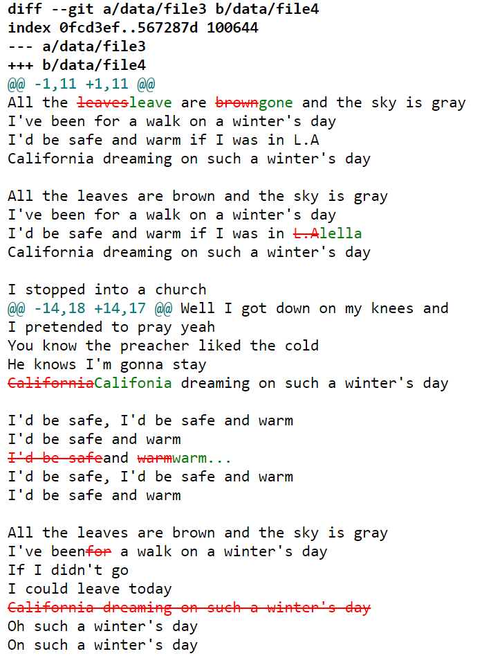

# pretty-git-diff

## Why：

  - Windows 上的 `vimdiff`（a.k.a. `vim -d file1 file2`）有点 bug
  - [Computed Diff - Diff Checker](https://www.diffchecker.com/diff) 很好用，但是命令行版本要注册
  - 我需要这个东西，实在是太需要了！

## Usage：

  - `./pgd.sh file1 file2`
  - 就这么简单（可以先 `make` 但不必须）

## 效果：

**file1**

```
沁园春·雪

作者：毛泽东

北国风光，千里冰封，万里雪飘。
望长城内外，惟余莽莽；大河上下，顿失滔滔。
山舞银蛇，原驰蜡象，欲与天公试比高。
须晴日，看红装素裹，分外妖娆。
江山如此多娇，引无数英雄竞折腰。
惜秦皇汉武，略输文采；唐宗宋祖，稍逊风骚。
一代天骄，成吉思汗，只识弯弓射大雕。
俱往矣，数风流人物，还看今朝。
```

**file2**

```
沁园春·Snow

作者：Tse-Dong Mao

北国风光，千里冰疯，万里雪彪。
长城内外莽莽；大河上，下顿失滔滔。
山舞银蛇，原驰蜡象，欲与天公试比高。
江山如此多娇，
引无数英雄竞折腰。
惜秦皇汉武，略输文采；唐宗宋祖，稍逊风骚。
一代天骄，成吉思汗，只识弯弓射大雕。
可惜！Shame on you!
俱往矣，数风流人物，还看今朝。
```

run in shell

```
./pgd.sh data/file1 data/file2
```

open `index.html` in browser:



英文效果好一点，[file3](data/file3), [file4](data/file4)

```
./pgd.sh data/file3 data/file4
```



---

注：

  - 基于 git
  - 基于 [district10/aha: Ansi HTML Adapter](https://github.com/district10/aha)
  - 基于 pandoc
